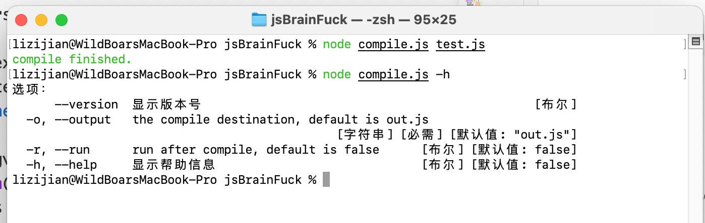
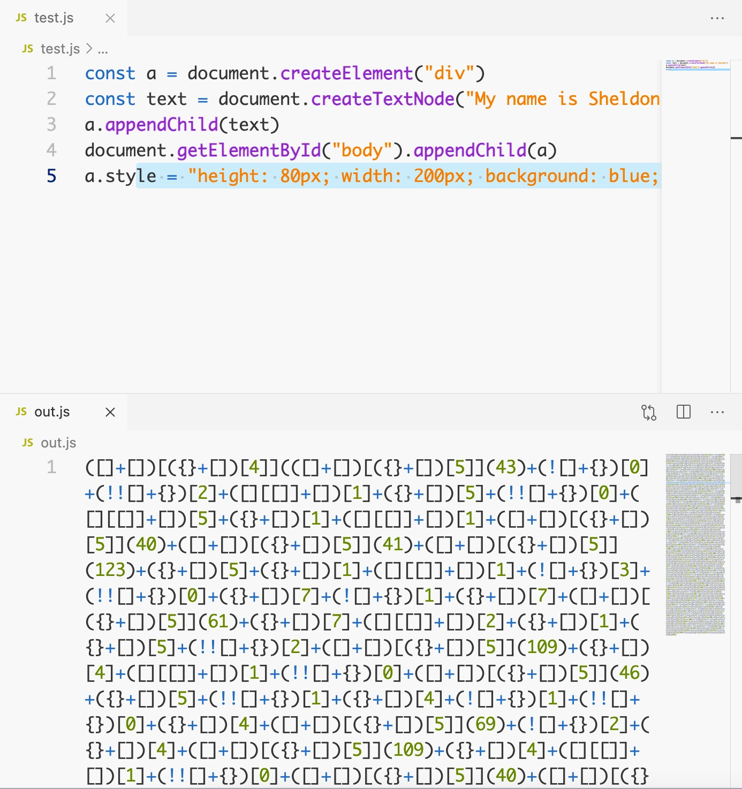

## Javascript Brainfuck
Author: MeetinaXD
Last Edit: Marc 21, 2021

> Treat your brain well

This is a meaningless project **for joy purposes**.

This project contains a `sample` of how to run JavaScript Brainfuck codes and a `compile` for **converting** normal codes to Brainfuck-like codes.

## Download and Run
There is no installation required, download the latest release and unpack the zip file.

### Run Sample
To view the sample, open `index.html` in your browser (`Google Chrome` is recommended)

Then, press `Command + Option + I` or `Ctrl + Shift + I` (On Windows) to open `DevTools`

See the log.

### Compiler Requirement

`Node` environment is requireto run `compile.js`, you may need to install `colors` `shelljs` and `yargs` package.

use **NPM**
```shell
npm i colors shelljs yargs
```

## Brainfuck Compiler
**screenshot**

**after compile**


You can get the usege in the terminal, use
```shell
node compile.js -h
```
**or**
```shell
node compile.js --help
```

Compiler offers you **3 options**, usage:
```shell
node compile.js sources [-o|--output] destination [-h|--help] [-r|--run] [-w|--watch]
```

### `-o | --output`
Specific the output path, **only ONE** path will be recognized as output path.

### `-h | --help`
Print out the help message age usage

### `-r | --run`
Run the codes after compile successfully.

### `-w | --watch`
Watch source files, auto compile when files change detected. It can use with `-r` or `--run`option, it will run the compiled codes after compile.

**For example:**
```shell
node compile.js main.js test.js -o output.js -w -r
```

## Additional Words
Hope you enjoy it and I highly recommend you do NOT use it in a commercial project.
If you insist on doing this, please do not leave personal information.
Life is once.